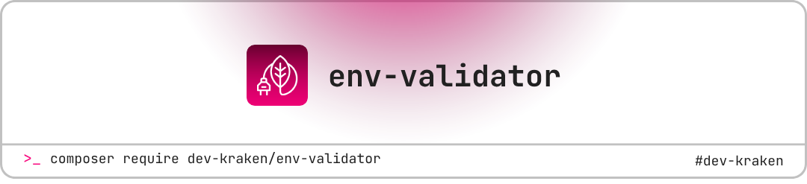

<a href="https://devkraken.com/">
  <picture>
    <source media="(prefers-color-scheme: dark)" srcset="images/header-dark.png">
    
  </picture>
</a>

# EnvValidator

> **Type-safe environment variable validation for Laravel and PHP applications**

[](https://packagist.org/packages/dev-kraken/env-validator)
[](https://packagist.org/packages/dev-kraken/env-validator)
[](https://github.com/dev-kraken/env-validator/actions)
[](https://packagist.org/packages/dev-kraken/env-validator)
[](https://packagist.org/packages/dev-kraken/env-validator)
[](https://github.com/dev-kraken/env-validator/actions)

EnvValidator is a modern, type-safe PHP package for validating environment variables in Laravel and standalone PHP applications. It provides robust validation with clear error messages, intelligent presets, extensible rule objects, and automatic environment file synchronization.

## :sparkles: Features

-   :lock: **Type-safe validation** with PHP 8.2+ and PHPStan level max
-   :dart: **Smart presets** for common scenarios (Laravel, microservices, production, etc.)
-   :jigsaw: **Extensible rule system** with custom Rule objects
-   :arrows_counterclockwise: **Environment sync** to keep `.env` and `.env.example` synchronized
-   :rocket: **Laravel integration** with auto-discovery and Artisan commands
-   :package: **Standalone support** for non-Laravel PHP applications
-   :shield: **Production-ready** with comprehensive test coverage
-   :memo: **Clear error messages** with detailed validation feedback

## :rocket: Quick Start

### Installation

```bash
composer require dev-kraken/env-validator
```

You can publish the configuration file with:

```bash
php artisan vendor:publish --provider="EnvValidator\EnvValidatorServiceProvider" --tag="config"
```

### Laravel Usage

```php
use EnvValidator\Facades\EnvValidator;

// Validate with default Laravel rules
EnvValidator::validate();

// Use preset for different scenarios
EnvValidator::useProductionRules()->validate();
EnvValidator::useMinimalRules()->validate();
EnvValidator::useApiRules()->validate();
```

### Standalone PHP Usage

#### Basic Example (String Rules)

```php
use EnvValidator\EnvValidator;

// Simple validation with string rules
$rules = [
    'APP_ENV' => 'required|string',
    'APP_DEBUG' => 'required|boolean',
    'APP_URL' => 'required|url',
    'DB_HOST' => 'required|string',
    'DB_PASSWORD' => 'required|string',
];

$result = EnvValidator::validateStandalone($_ENV, $rules);

if ($result !== true) {
    echo "❌ Environment validation failed:\n";
    foreach ($result as $field => $errors) {
        foreach ($errors as $error) {
            echo "  • $error\n";
        }
    }
    exit(1);
}

echo "✅ Environment validation passed!\n";
```

#### Advanced Example (Rule Objects)

```php
use EnvValidator\EnvValidator;
use EnvValidator\Collections\StringRules\{InRule, BooleanRule};
use EnvValidator\Collections\NetworkRules\UrlRule;

$validator = new EnvValidator();
$validator->setRules([
    'APP_ENV' => ['required', 'string', new InRule(['staging', 'production'])],
    'APP_DEBUG' => ['required', new BooleanRule()],
    'APP_URL' => ['required', new UrlRule()],
]);

// For standalone PHP, use validateStandalone method
$result = EnvValidator::validateStandalone($_ENV, $validator->getRules());

if ($result !== true) {
    // Handle validation errors
    foreach ($result as $field => $errors) {
        foreach ($errors as $error) {
            echo "Error: $error\n";
        }
    }
    exit(1);
}

echo "✅ Environment validation passed!\n";
```

### Required Field Validation

EnvValidator properly handles required field validation in both Laravel and standalone PHP environments:

```php
// All these formats work for required validation
$rules = [
    'APP_KEY' => ['required', 'string', 'min:32'],        // Array format (recommended)
    'APP_ENV' => 'required|string',                       // String format
    'DB_PASSWORD' => ['required'],                        // Required only
    'API_URL' => ['string', 'required', new UrlRule()],  // Required anywhere in array
];

// Standalone validation
$result = EnvValidator::validateStandalone($_ENV, $rules);

if ($result !== true) {
    // Handle validation errors
    foreach ($result as $field => $errors) {
        echo "Error in $field: " . implode(', ', $errors) . "\n";
    }
}
```

Required fields fail validation when they are:

-   ❌ **Missing** from the environment
-   ❌ **Empty strings** (`''`)
-   ❌ **Null values**
-   ✅ **Present with valid values**

## :clipboard: Built-in Rule Presets

| Preset         | Description                  | Use Case                         |
| -------------- | ---------------------------- | -------------------------------- |
| `laravel`      | Complete Laravel application | Full-featured web applications   |
| `minimal`      | Essential variables only     | Microservices, lightweight apps  |
| `production`   | Production-ready settings    | Deployment environments          |
| `api`          | API-focused applications     | REST APIs, headless applications |
| `microservice` | Microservice-specific        | Containerized services           |
| `docker`       | Docker/containerized apps    | Container deployments            |

### Preset Usage Examples

```php
// Laravel application
$validator = (new EnvValidator())->usePreset('laravel');

// Microservice
$validator = (new EnvValidator())->usePreset('microservice');

// Production deployment
$validator = (new EnvValidator())->useProductionRules();

// Custom combination
$validator = (new EnvValidator())
    ->useMinimalRules()
    ->addRule('CUSTOM_API_KEY', ['required', 'string', 'min:32']);
```

## :dart: Rule Objects vs String Rules

EnvValidator uses **Rule objects** for better type safety and maintainability:

### :white_check_mark: Rule Objects (Recommended)

```php
use EnvValidator\Collections\StringRules\{InRule, BooleanRule};
use EnvValidator\Collections\NetworkRules\UrlRule;

$rules = [
    'APP_ENV' => ['required', 'string', new InRule(['staging', 'production'])],
    'APP_DEBUG' => ['required', new BooleanRule()],
    'APP_URL' => ['required', new UrlRule()],
];
```

**Benefits:**

-   :mag: **IDE autocompletion** and type hints
-   :test_tube: **Easy unit testing** of individual rules
-   :recycle: **Reusable** across multiple fields
-   :art: **Custom error messages** with context
-   :wrench: **Better debugging** and inspection

### :books: Available Rule Objects

#### String Rules

-   `BooleanRule` - Validates boolean values (true, false, 1, 0, yes, no, etc.)
-   `InRule` - Validates value is in a list of allowed values
-   `KeyRule` - Validates Laravel application keys (base64: format)
-   `PatternRule` - Validates against regex patterns
-   `EmailRule` - Validates email addresses
-   `JsonRule` - Validates JSON strings

#### Numeric Rules

-   `NumericRule` - Validates numeric values
-   `IntegerRule` - Validates integer values
-   `PortRule` - Validates port numbers (1-65535)

#### Network Rules

-   `UrlRule` - Validates URLs
-   `IpRule` - Validates IP addresses

## :hammer_and_wrench: Advanced Usage

### Custom Rules

```php
use EnvValidator\Core\AbstractRule;

class CustomRule extends AbstractRule
{
    public function passes($attribute, $value): bool
    {
        return str_starts_with($value, 'custom_');
    }

    public function message(): string
    {
        return 'The :attribute must start with "custom_".';
    }
}

// Usage
$validator->addRule('CUSTOM_FIELD', [new CustomRule()]);
```

### Environment-Specific Validation

```php
// Development environment
if (app()->environment('local', 'development')) {
    $validator->useMinimalRules();
} else {
    // Production environment
    $validator->useProductionRules();
}
```

### Conditional Validation

```php
$rules = [
    'DB_HOST' => ['required_unless:DB_CONNECTION,sqlite', 'string'],
    'DB_PORT' => ['required_unless:DB_CONNECTION,sqlite', new PortRule()],
    'REDIS_HOST' => ['required_if:CACHE_DRIVER,redis', 'string'],
];
```

## :art: Laravel Integration

### Artisan Commands

```bash
# Validate all environment variables
php artisan env:validate

# Validate specific variables
php artisan env:validate --keys=APP_KEY --keys=APP_URL

# Verbose output with debugging info
php artisan env:validate -v
```

## :arrows_counterclockwise: Environment File Synchronization

Keep your `.env` and `.env.example` files synchronized automatically! This feature helps prevent deployment issues when developers add new environment variables but forget to update the example file.

### :mag: Check Synchronization Status

```bash
# Check if .env and .env.example are synchronized
php artisan env:sync --check
```

**Sample Output:**

```
🔍 Checking environment file synchronization...

⚠️  3 key(s) missing in .env.example, 1 extra key(s) in .env.example

📊 Statistics:
   • .env keys: 15
   • .env.example keys: 13

🔍 Missing in .env.example:
   📂 Sensitive:
      • STRIPE_SECRET = ********
   📂 Third party:
      • STRIPE_PUBLIC_KEY = pk_test_1234...
   📂 Application:
      • FEATURE_FLAG_NEW_UI = true

🗑️  Extra in .env.example:
   • LEGACY_API_KEY

💡 Suggestions:
   • Add missing keys to .env.example
   • Remove unused keys from .env.example
```

### :gear: Synchronization Commands

```bash
# Automatically synchronize files (with confirmation)
php artisan env:sync

# Force sync without confirmation
php artisan env:sync --force

# Add keys with empty values (security-conscious)
php artisan env:sync --no-values

# Remove extra keys from .env.example
php artisan env:sync --remove-extra

# Use custom file paths
php artisan env:sync --env-path=/custom/.env --example-path=/custom/.env.example
```

### :shield: Security Features

The sync command automatically handles sensitive data:

-   **Sensitive keys** (PASSWORD, SECRET, KEY, TOKEN) get **empty values**
-   **URLs** become `https://example.com`
-   **Email addresses** become `user@example.com`
-   **Boolean values** are standardized to `true`
-   **Numeric values** (ports, timeouts) are preserved
-   **Environment names** get appropriate defaults (`production`)

### :building_construction: Integration with CI/CD

Add environment sync checks to your deployment pipeline:

```bash
# In your CI/CD pipeline
php artisan env:sync --check
if [ $? -ne 0 ]; then
    echo "❌ Environment files are out of sync!"
    echo "Run 'php artisan env:sync' to fix."
    exit 1
fi
```

### :computer: Programmatic Usage

```php
use EnvValidator\Services\EnvExampleSyncService;
use EnvValidator\Facades\EnvSync;

// Using the facade
$report = EnvSync::getSyncReport();
if ($report['status'] !== 'synced') {
    // Handle out-of-sync files
    $result = EnvSync::syncToExample(['generate_values' => true]);
}

// Using the service directly
$syncService = new EnvExampleSyncService();
$report = $syncService->getSyncReport();

// Check specific conditions
if ($syncService->envFileExists() && !$syncService->exampleFileExists()) {
    // Create .env.example from .env
    $syncService->syncToExample(['generate_values' => true]);
}

// Get validation rule suggestions for new keys
$comparison = $syncService->compareFiles();
$suggestedRules = $syncService->suggestValidationRules(
    $comparison['missing_in_example']
);
```

### :computer: Standalone PHP Usage

The environment sync feature works perfectly in standalone PHP applications (without Laravel):

```php
use EnvValidator\Services\EnvExampleSyncService;

// IMPORTANT: Always provide explicit paths in standalone PHP
$syncService = new EnvExampleSyncService(
    __DIR__ . '/.env',           // Path to your .env file
    __DIR__ . '/.env.example'    // Path to your .env.example file
);

// Check synchronization status
$report = $syncService->getSyncReport();
if ($report['status'] !== 'synced') {
    echo "⚠️  Environment files are out of sync!\n";

    // Show what's missing
    foreach ($report['missing_in_example'] as $category => $keys) {
        echo "Missing {$category} keys: " . implode(', ', array_keys($keys)) . "\n";
    }

    // Auto-sync files
    $result = $syncService->syncToExample([
        'add_missing' => true,
        'remove_extra' => true,
        'generate_values' => true
    ]);

    if ($result['success']) {
        echo "✅ Files synchronized successfully!\n";
    }
}

// Integration with validation
$rules = [
    'APP_ENV' => 'required|string',
    'DB_HOST' => 'required|string',
    'API_KEY' => 'required|string|min:10',
];

$validationResult = EnvValidator::validateStandalone($_ENV, $rules);
if ($validationResult !== true) {
    // Handle validation errors
    foreach ($validationResult as $field => $errors) {
        echo "Error in {$field}: " . implode(', ', $errors) . "\n";
    }
}
```

#### Different Project Structures

```php
// Current directory
$syncService = new EnvExampleSyncService(
    getcwd() . '/.env',
    getcwd() . '/.env.example'
);

// Config directory
$syncService = new EnvExampleSyncService(
    getcwd() . '/config/.env',
    getcwd() . '/config/.env.example'
);

// Absolute paths
$syncService = new EnvExampleSyncService(
    '/var/www/app/.env',
    '/var/www/app/.env.example'
);

// Custom file names
$syncService = new EnvExampleSyncService(
    getcwd() . '/environment.conf',
    getcwd() . '/environment.example.conf'
);
```

#### Deployment Script Integration

```php
#!/usr/bin/env php
<?php
// deployment.php
require_once 'vendor/autoload.php';

use EnvValidator\Services\EnvExampleSyncService;
use EnvValidator\EnvValidator;

echo "🚀 Deployment: Environment Check\n";

// 1. Check environment sync
$syncService = new EnvExampleSyncService(__DIR__ . '/.env', __DIR__ . '/.env.example');
$report = $syncService->getSyncReport();

if ($report['status'] !== 'synced') {
    echo "❌ ERROR: Environment files are out of sync!\n";
    echo "Missing keys: " . count($report['missing_in_example'] ?? []) . "\n";
    echo "Extra keys: " . count($report['extra_in_example'] ?? []) . "\n";
    exit(1);
}

// 2. Validate environment
$rules = [
    'APP_ENV' => 'required|string',
    'DB_HOST' => 'required|string',
    'API_KEY' => 'required|string|min:32',
];

$result = EnvValidator::validateStandalone($_ENV, $rules);
if ($result !== true) {
    echo "❌ ERROR: Environment validation failed!\n";
    foreach ($result as $field => $errors) {
        echo "  • {$field}: " . implode(', ', $errors) . "\n";
    }
    exit(1);
}

echo "✅ Environment check passed - ready for deployment!\n";
```

### :bulb: Best Practices

#### Laravel Projects

1. **Before Deployments**: Always run `php artisan env:sync --check`
2. **In Development**: Use `php artisan env:sync` when adding new variables
3. **Team Workflow**:
    - Add new variables to `.env`
    - Run `php artisan env:sync`
    - Commit both `.env.example` and updated validation rules
4. **CI/CD Integration**: Fail builds if files are out of sync
5. **Security**: Use `--no-values` flag for highly sensitive projects

#### Standalone PHP Projects

1. **Always specify absolute paths**: Use `__DIR__` or `getcwd()` for reliable paths
2. **Check file existence**: Use `$syncService->envFileExists()` before operations
3. **Handle errors gracefully**: Always check `$result['success']` before proceeding
4. **Integrate with deployment**: Add sync checks to your deployment scripts
5. **Combine with validation**: Use sync + validation for complete environment safety

### Service Provider Configuration

```php
// config/env-validator.php
return [
    'validate_on_boot' => ['APP_KEY', 'APP_ENV'], // Validate on app boot
    'rules' => [
        'CUSTOM_VAR' => ['required', 'string'],
    ],
    'messages' => [
        'APP_KEY.required' => 'Application key is required for security.',
    ],
];
```

### Facade Usage

```php
use EnvValidator\Facades\EnvValidator;

// Method chaining
EnvValidator::useProductionRules()
    ->addRule('API_KEY', ['required', 'string', 'min:32'])
    ->validate();

// Validate specific keys only
EnvValidator::validateOnly(['APP_KEY', 'APP_ENV']);
```

## :test_tube: Testing

### Running Tests

```bash
# Run all tests
composer test

# Run with coverage
composer test -- --coverage

# Run specific test suite
vendor/bin/pest tests/Unit
vendor/bin/pest tests/Feature
```

### Code Quality

```bash
# Static analysis
composer analyse

# Code style check
composer cs

# Fix code style
composer cs:fix

# Run all checks
composer check
```

## :book: Examples

The `examples/` directory contains comprehensive examples demonstrating various use cases:

-   **`comprehensive_examples.php`** - Complete feature showcase with presets and rule objects
-   **`required_field_examples.php`** - Detailed required field validation examples
-   **`env_sync_examples.php`** - Environment file synchronization demonstrations (Laravel)
-   **`standalone_env_sync_examples.php`** - Environment sync for standalone PHP applications
-   **`preset_examples.php`** - Preset system demonstrations
-   **`rule_objects_demo.php`** - Rule object usage and benefits

### Real-World Scenarios

```php
// E-commerce application
$validator = (new EnvValidator())
    ->usePreset('laravel')
    ->addRules([
        'STRIPE_KEY' => ['required', 'string', 'min:32'],
        'STRIPE_SECRET' => ['required', 'string', 'min:32'],
        'PAYMENT_WEBHOOK_SECRET' => ['required', 'string'],
    ]);

// Microservice with health checks
$validator = (new EnvValidator())
    ->usePreset('microservice')
    ->addRules([
        'HEALTH_CHECK_ENDPOINT' => ['required', new UrlRule()],
        'SERVICE_TIMEOUT' => ['required', 'integer', 'min:1', 'max:300'],
    ]);

// Multi-environment configuration
$rules = match(env('APP_ENV')) {
    'production' => DefaultRulePresets::production(),
    'staging' => DefaultRulePresets::production(),
    'testing' => DefaultRulePresets::minimal(),
    default => DefaultRulePresets::laravel(),
};
```

### Running Examples

```bash
# Run comprehensive examples
php examples/comprehensive_examples.php

# Explore required field validation
php examples/required_field_examples.php

# Environment file synchronization demos (Laravel)
php examples/env_sync_examples.php

# Standalone PHP environment sync demos
php examples/standalone_env_sync_examples.php

# See preset system in action
php examples/preset_examples.php
```

## :handshake: Contributing

We welcome contributions! Please see [CONTRIBUTING.md](CONTRIBUTING.md) for details.

### Development Setup

```bash
git clone https://github.com/dev-kraken/env-validator.git
cd env-validator
composer install
composer test
```

## :page_facing_up: License

The MIT License (MIT). Please see [License File](LICENSE.md) for more information.

## :lock: Security

If you discover any security vulnerabilities, please send an email to soman@devkraken.com instead of using the issue tracker.

## :telephone_receiver: Support

-   :email: **Email**: soman@devkraken.com
-   :bug: **Issues**: [GitHub Issues](https://github.com/dev-kraken/env-validator/issues)
-   :speech_balloon: **Discussions**: [GitHub Discussions](https://github.com/dev-kraken/env-validator/discussions)

---

<p align="center">
Made with :heart: by <a href="https://devkraken.com">Dev Kraken</a>
</p>
