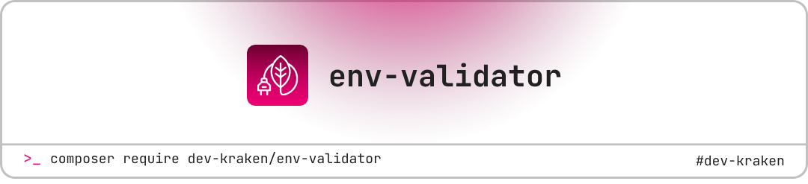

<a href="https://devkraken.com/">
  <picture>
    <source media="(prefers-color-scheme: dark)" srcset="images/header-dark.png">
    
  </picture>
</a>

# EnvValidator

> Environment variables validation for Laravel and PHP applications

[](https://packagist.org/packages/dev-kraken/env-validator)
[](https://packagist.org/packages/dev-kraken/env-validator)
[](https://github.com/dev-kraken/env-validator/actions)
[](https://packagist.org/packages/dev-kraken/env-validator)

EnvValidator is a modern PHP package for validating environment variables in Laravel and standalone PHP applications. It provides a robust, type-safe way to ensure your application's configuration is correctly set up.

## Why EnvValidator?

Environment variables play a crucial role in application configuration, but Laravel doesn't provide built-in validation for them. EnvValidator fills this gap by:

- Validating environment variables against defined rules
- Providing clear error messages when validation fails
- Working in both Laravel and standalone PHP applications
- Supporting custom validation rules and dynamic validation logic
- Being fully compatible with PHP 8.2+ and Laravel 11-12

## Installation

You can install the package via composer:

```bash
composer require dev-kraken/env-validator
```

### Laravel Setup

If you're using Laravel, the package will be auto-discovered.

You can publish the configuration file with:

```bash
php artisan vendor:publish --provider="EnvValidator\EnvValidatorServiceProvider" --tag="config"
```

## Default Validation Rules

The package includes default validation rules for common Laravel environment variables:

| Variable            | Validation Rule                                           |
| ------------------- | --------------------------------------------------------- |
| APP_NAME            | required, string                                          |
| APP_ENV             | required, string, in:local,development,staging,production |
| APP_KEY             | required, string, valid Laravel key format                |
| APP_DEBUG           | required, boolean                                         |
| APP_URL             | required, valid URL                                       |
| APP_LOCALE          | required, string                                          |
| APP_FALLBACK_LOCALE | required, string                                          |
| APP_FAKER_LOCALE    | nullable, string                                          |

## Basic Usage

### Laravel

```php
use EnvValidator\Facades\EnvValidator;

try {
    EnvValidator::validate();
    // Environment is valid
} catch (EnvValidator\Exceptions\InvalidEnvironmentException $e) {
    // Handle validation failure
    echo $e->getMessage();

    // Get detailed validation errors
    $errors = $e->getValidationErrors();
    if ($errors) {
        print_r($errors);
    }
}
```

### Standalone PHP

```php
require_once __DIR__.'/vendor/autoload.php';

use EnvValidator\EnvValidator;

// Load environment variables from .env file
$dotenv = Dotenv\Dotenv::createImmutable(__DIR__);
$dotenv->load();

// Define validation rules
$rules = [
    'APP_ENV' => 'required|string|in:local,development,staging,production',
    'APP_DEBUG' => 'required|in:true,false',
    'APP_URL' => 'required|url',
];

// Custom error messages
$messages = [
    'APP_URL.url' => 'The application URL must be a valid URL.',
];

// Validate environment
$result = EnvValidator::validateStandalone($_ENV, $rules, $messages);

if ($result !== true) {
    // Handle validation failure
    print_r($result);
}

echo 'Environment variables are valid.';
```

## Command Line Validation

```bash
# Validate all environment variables
php artisan env:validate

# Validate specific variables
php artisan env:validate --keys=APP_KEY --keys=APP_URL
```

## Available Validation Rules

EnvValidator provides several built-in validation rules:

### BooleanRule

Validates that a value is a boolean (true, false, 1, 0, yes, no, on, off).

```php
use EnvValidator\Collections\StringRules\BooleanRule;

EnvValidator::addRule('APP_DEBUG', [new BooleanRule()]);
// or
EnvValidator::addRule('APP_DEBUG', [BooleanRule::class]);
```

### UrlRule

Validates that a value is a valid URL.

```php
use EnvValidator\Collections\NetworkRules\UrlRule;

EnvValidator::addRule('APP_URL', [new UrlRule()]);
// or
EnvValidator::addRule('APP_URL', [UrlRule::class]);
```

### KeyRule

Validates that a value is a valid Laravel application key.

```php
use EnvValidator\Collections\StringRules\KeyRule;

EnvValidator::addRule('APP_KEY', [new KeyRule()]);
// or
EnvValidator::addRule('APP_KEY', [KeyRule::class]);
```

### NumericRule

Validates that a value is numeric and optionally within a specific range.

```php
use EnvValidator\Collections\NumericRules\NumericRule;

// Value must be numeric
EnvValidator::addRule('CACHE_TTL', [new NumericRule()]);

// Value must be an integer
EnvValidator::addRule('REDIS_PORT', [new NumericRule(allowDecimals: false)]);

// Value must be between 1 and 100
EnvValidator::addRule('PERCENTAGE', [new NumericRule(min: 1, max: 100)]);
```

### IntegerRule

Validates that a value is an integer and optionally within a specific range.

```php
use EnvValidator\Collections\NumericRules\IntegerRule;

// Value must be an integer
EnvValidator::addRule('REDIS_PORT', [new IntegerRule()]);

// Value must be a positive integer
EnvValidator::addRule('POSITIVE_INT', [new IntegerRule(min: 1)]);

// Value must be between 1 and 100
EnvValidator::addRule('PERCENTAGE', [new IntegerRule(min: 1, max: 100)]);
```

### PatternRule

Validates that a value matches a specific regular expression pattern.

```php
use EnvValidator\Collections\StringRules\PatternRule;

// Value must be a valid IP address
EnvValidator::addRule('SERVER_IP', [
    new PatternRule('/^(\d{1,3}\.){3}\d{1,3}$/', 'The IP address format is invalid.')
]);
```

### IpRule

Validates that a value is a valid IP address (IPv4 or IPv6).

```php
use EnvValidator\Collections\NetworkRules\IpRule;

// Value must be any valid IP address
EnvValidator::addRule('SERVER_IP', [new IpRule()]);

// Value must be a valid IPv4 address
EnvValidator::addRule('SERVER_IP_V4', [new IpRule(IpRule::IPV4)]);

// Value must be a valid IPv6 address
EnvValidator::addRule('SERVER_IP_V6', [new IpRule(IpRule::IPV6)]);
```

## Auto-Validation on Application Boot

Enable auto-validation by setting `ENV_AUTO_VALIDATE=true` in your `.env` file or by updating the config file.

You can also specify which variables to validate on boot:

```php
// config/env-validator.php
return [
    'auto_validate' => true,
    'validate_on_boot' => [
        'APP_KEY', 'APP_URL', 'DB_CONNECTION'
    ],
];
```

## Creating Custom Validation Rules

You can create custom validation rules by extending the AbstractRule class:

```php
use EnvValidator\Core\AbstractRule;

class CustomRule extends AbstractRule
{
    public function passes(string $attribute, mixed $value): bool
    {
        // Your validation logic here
        return true;
    }

    public function message(): string
    {
        return 'The :attribute failed validation.';
    }
}
```

Then use it in your rules:

```php
EnvValidator::addRule('CUSTOM_ENV_VAR', [new CustomRule()]);
```

## Custom Validation Rules in Config

You can add custom validation rules in your config file:

```php
// config/env-validator.php
return [
    'rules' => [
        'CUSTOM_ENV_VAR' => 'required|integer|min:10',
        'API_TIMEOUT' => 'required|integer|between:30,120',
    ],
];
```

## Custom Error Messages

You can customize error messages for specific validation rules:

```php
// config/env-validator.php
return [
    'messages' => [
        'APP_KEY.required' => 'The application key is missing. Generate one using "php artisan key:generate"',
        'APP_URL.url' => 'The application URL must be a valid URL starting with http:// or https://',
    ],
];
```

## Quality Assurance

This package comes with several QA tools out of the box:

```bash
# Run tests
composer test

# Run static analysis
composer analyse

# Check code style
composer cs

# Fix code style
composer cs:fix

# Run all checks (tests, static analysis, code style)
composer check
```

## License

The MIT License (MIT). Please see [License File](LICENSE.md) for more information.

## Contributing

Please see [CONTRIBUTING](CONTRIBUTING.md) for details.
